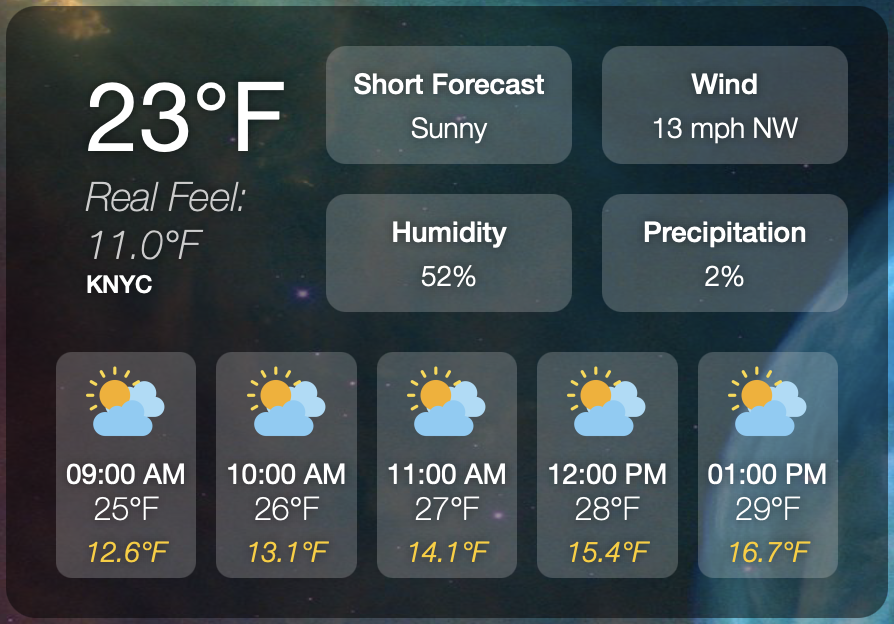

# Weather Widget: Real Feel Temp calculator widget



This widget dynamically fetches and displays weather data, including the calculated "Real Feel" temperature, based on the National Weather Service (NWS) API.

## Features
- **Real Feel Calculation**:
  - Calculates a realistic temperature perception using wind chill (for cold conditions) and heat index (for hot conditions).
  - Integrates multiple factors like temperature, wind speed, and humidity.
 ``` javascript
    // Calculate Real Feel
    const calculateRealFeel = (temperature, windSpeed, humidity) => {
      if (temperature === null) return null;

      const tempFahrenheit = parseFloat(temperature);
      const windSpeedMph = windSpeed ? parseFloat(windSpeed) : 0;
      const humidityPercent = humidity ? parseFloat(humidity) : 0;

      // Wind chill for cold conditions
      if (tempFahrenheit <= 50 && windSpeedMph >= 3) {
        return (
          35.74 +
          0.6215 * tempFahrenheit -
          35.75 * Math.pow(windSpeedMph, 0.16) +
          0.4275 * tempFahrenheit * Math.pow(windSpeedMph, 0.16)
        ).toFixed(1);
      }
      // Heat index for hot conditions
      else if (tempFahrenheit >= 80 && humidityPercent >= 40) {
        return (
          -42.379 +
          2.04901523 * tempFahrenheit +
          10.14333127 * humidityPercent -
          0.22475541 * tempFahrenheit * humidityPercent -
          0.00683783 * Math.pow(tempFahrenheit, 2) -
          0.05481717 * Math.pow(humidityPercent, 2) +
          0.00122874 * Math.pow(tempFahrenheit, 2) * humidityPercent +
          0.00085282 * tempFahrenheit * Math.pow(humidityPercent, 2) -
          0.00000199 * Math.pow(tempFahrenheit, 2) * Math.pow(humidityPercent, 2)
        ).toFixed(1);
      }
```
- **Real-Time Weather Data**:
  - Fetches hourly forecasts from the NWS API.
  - Automatically updates every 10 minutes.
- **Detailed Weather Information**:
  - Displays current temperature, real feel, wind speed, humidity, precipitation probability, and a short forecast.
  - Includes a 5-hour forecast with visual icons for quick reference.

## Technical Highlights
- Built with JSX for a clean and modern user interface.
- Uses asynchronous API calls to dynamically render weather data.
- Modular and easily customizable for different use cases.

## Requirements
- Node.js and a compatible runtime to execute the script.
- Internet access to fetch data from the NWS API.

## How It Works
1. Fetches hourly forecast data using the NWS API.
2. Dynamically parses the JSON response to extract necessary weather details.
3. Calculates the "Real Feel" temperature based on the following:
   - **Cold Conditions**: Wind chill is calculated if the temperature is below 50°F and wind speed is above 3 mph.
   - **Hot Conditions**: Heat index is calculated if the temperature exceeds 80°F and humidity is significant.
4. Renders the data in an intuitive and visually appealing format.

## Installation
1. Clone the repository.
2. Ensure you have a compatible runtime (e.g., Übersicht for macOS).
3. Add the widget files to the appropriate directory.
4. Adjust API configurations if needed.

## Required Images


# Weather Widget: Real Feel Temperature Display

This widget dynamically fetches and displays weather data, including the calculated "Real Feel" temperature, based on the National Weather Service (NWS) API.

## Features
- **Real Feel Calculation**:
  - Calculates a realistic temperature perception using wind chill (for cold conditions) and heat index (for hot conditions).
  - Integrates multiple factors like temperature, wind speed, and humidity.
- **Real-Time Weather Data**:
  - Fetches hourly forecasts from the NWS API.
  - Automatically updates every 10 minutes.
- **Detailed Weather Information**:
  - Displays current temperature, real feel, wind speed, humidity, precipitation probability, and a short forecast.
  - Includes a 5-hour forecast with visual icons for quick reference.

## Technical Highlights
- Uses asynchronous API calls to dynamically render weather data.
- Modular and easily customizable for different use cases.

## Requirements
- Node.js and a compatible runtime to execute the script.
- Internet access to fetch data from the NWS API.

## How It Works
1. Fetches hourly forecast data using the NWS API.
2. Dynamically parses the JSON response to extract necessary weather details.
3. Calculates the "Real Feel" temperature based on the following:
   - **Cold Conditions**: Wind chill is calculated if the temperature is below 50°F and wind speed is above 3 mph.
   - **Hot Conditions**: Heat index is calculated if the temperature exceeds 80°F and humidity is significant.
4. Renders the data in an intuitive and visually appealing format.

## Installation
1. Clone the repository.
2. Ensure you have a compatible runtime (e.g., Übersicht for macOS).
3. Add the widget files to the appropriate directory.
4. Adjust API configurations if needed.

## Required images
``` sh
weatherTV.widget/images
.
├── ChanceVeryLightSnow.png
├── Cloudy-old.png
├── Cloudy.ai
├── Cloudy.png
├── Fog.png
├── MostlyClear.png
├── MostlyCloudy.png
├── MostlySunny.png
├── PartlyCloudy.png
├── Rain.png
├── Showers.png
├── Snow.png
├── Sunny.png
├── ThunderStorm.png
├── VeryLightSnowLikely.png
└── default.png
```
## Customization
- Modify `refreshFrequency` to change the update interval.
- Adjust CSS classes in `className` to customize the appearance.
